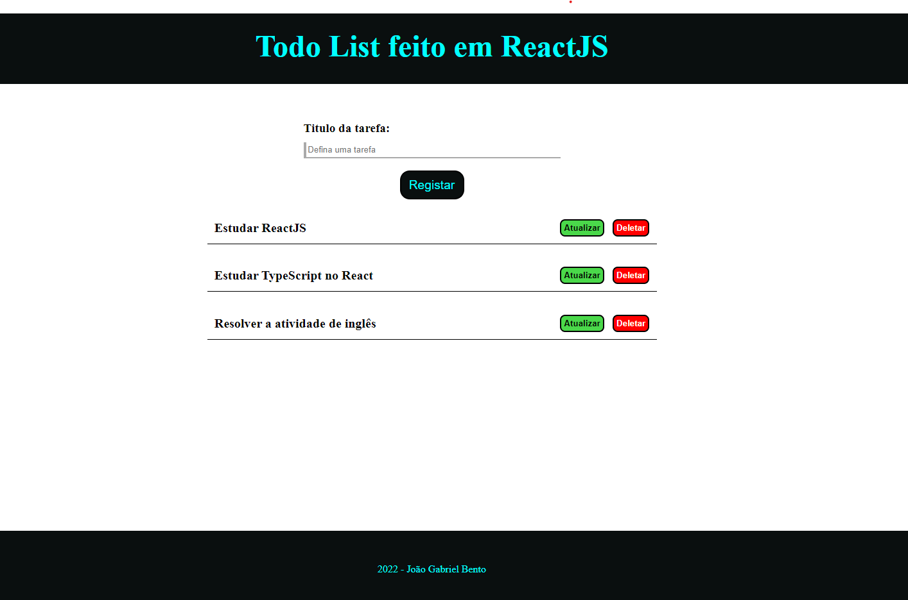

## Todo List feito em ReactJS

Ele serve como o app para você registrar as tarefas que você tem que realizar de forma a ajudar em sua organização.

## Template

### Como funciona

Primeira mente você deve definer o título da sua tarefa, sendo possível atualiza-la e deleta-la.

Para atualizar o título da tarefa basta clicar no botão de atualizar e irá aparecer um modal no qual você poderá definer o novo título, o modal será fechado automaticamente após clicar em registrar ou se clicar na região fora do modal.

Para deletar basta clicar no botão de deletar e a tarefa será deletada automaticamente.
